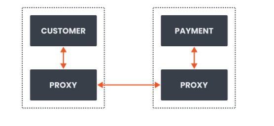
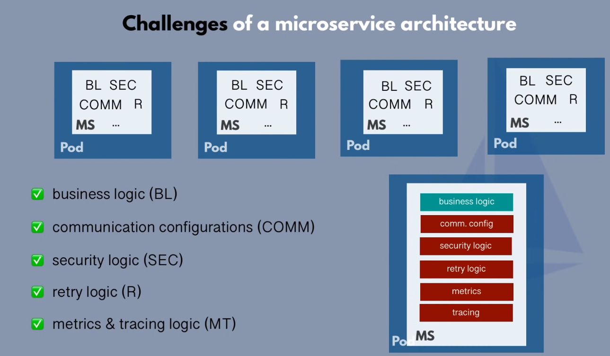
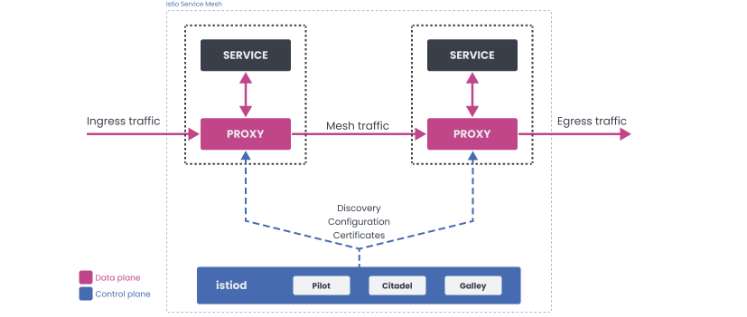

## Service mesh 

+ A service mesh is defined as a dedicated infrastructure layer for managing service-to-service communication to make it manageable, visible, and controlled. 

+ In some versions of the definition, you might also hear about how a service mesh can make the communication between services safe and reliable.

+ Service mesh is all about the communication between services.

+ The communication logic is any code that handles the inbound or outbound requests, the retry logic, timeouts, or even perhaps traffic routing.

<br>


+ Service mesh takes this communication logic, the retries, timeouts, and so on, out of the individual service and moves it into a separate infrastructure layer. 

+ The infrastructure layer, in the case of a service mesh, is an array of network proxies. 

+ The collection of these network proxies deals with all communication logic between your services. 

+ We call these proxies sidecars because they live alongside each service

<br>



+ The communication logic separated from the business and application logic allows the developers to focus on the business logic, and service mesh operators focus on the service mesh configuration.

### Why do I need a service mesh?

+ A service mesh gives us a consistent way to connect, secure, and observe microservices. Every failure, successful call, retry, or timeout can be captured, visualized, and alerted.

<br>

+ **Developers and operators can configure and execute the following scenarios without any code changes to the services:**
    
    + mutual TLS and automatic certificate rotation
    
    + identifying performance and reliability issues using metrics
    
    + visualizing metrics in tools like Grafana; this further allows altering and integrating with PagerDuty, for example
    
    + debugging services and tracing using Jaeger or Zipkin*
    
    + weight-based and request based traffic routing, canary deployments, A/B testing
    
    + traffic mirroring
    
    + increase service resiliency with timeouts and retries
    
    + chaos testing by injecting failures and delays between services
    
    + circuit breakers for detecting and ejecting unhealthy service instances.


## Introducing Istio



<br>

+ Istio is an open-source implementation of a service mesh.

+ Istio supports the following features:

    + Traffic management

        + Using configuration, we can control the flow of traffic between services. Setting up circuit breakers, timeouts, or retries can be done with a simple configuration change.


    + Observability
        + Istio gives us a better understanding of your services through tracing, monitoring, and logging, and it allows us to detect and fix issues quickly.

    + Security

        + Istio can manage authentication, authorization, and encryption of the communication at the proxy level. We can enforce policies across services with a quick configuration change.

### Istio Components

+ Istio service mesh has two pieces: 

   + a data plane 
   + a control plane

+ The data plane in Istio consists of Envoy proxies that control the communication between services. 

+ The control plane portion of the mesh is responsible for managing and configuring the proxies.

<br>




#### Envoy (Data Plane)

+ Envoy is a high-performance proxy developed in C++. 

+ Istio service mesh injects the Envoy proxy as a sidecar container next to your application container. 

+ The proxy then intercepts all inbound and outbound traffic for that service. 

+ Together, the injected proxies form the data plane of a service mesh.

+ Envoy proxy is also the only component that interacts with the traffic. 

+ It provide features mentioned earlier - the load balancing, circuit breakers, fault injection, etc.

#### Istiod (Control Plane)

+ Istiod is the control plane component that provides service discovery, configuration, and certificate management features. 

+ Istiod takes the high-level rules written in YAML and converts them into an actionable configuration for Envoy. 

+ Then, it propagates this configuration to all sidecars in the mesh.


+ Using the built-in identity and credential management, we can enable strong service-to-service and end-user authentication. 

+ With authorization features, we can control who can access your services.

+ The portion of the control plane, formerly known as Citadel, acts as a certificate authority and generates certificates that allow secure mutual TLS communication between the proxies in the data plane.


+ Istio consists of multiple components that can be deployed together or separately.

+ The core components are:

    
    + istiod: the Istio control plane.
    
    + Istio ingress gateway: a deployment of Envoy designed to manage ingress traffic into the mesh.
    
    + Istio egress gateway: a deployment of Envoy designed for managing egress traffic out of the mesh.

+ The Envoy sidecars are also components of a service mesh, but they do not feature in the installation process. 

+ The sidecars are deployed alongside Kubernetes workloads post-installation.

### Istio configuration profiles

+ Istio configuration profiles simplify the process of configuring an Istio service mesh.

+ Each profile configures Istio in a specific way for a particular use case.

+ The list of profiles includes:

    + **minimal :** installs only the Istio control plane, no gateway components
    
    + **default :** recommended for production deployments, deploys the Istio control plane and an ingress gateway
    
    + **demo :** useful for showcasing Istio, for demonstration or learning purposes, and deploys all Istio core components
    
    + **empty :** a base profile for custom configurations, often used for deploying additional, perhaps dedicated gateways
    
    + **preview :** deploys Istio with experimental (preview) features
    
    + **remote :** used in the context of installing Istio on a remote cluster (where the control plane resides in another cluster)

<br>    

| Profile | default | demo | minimal|remote|empty|preview|
| :---:   | :---: | :---: |:---:|:---:|:---:|:---:|
| Core components|    |   |     |     |     |     |
| istio-egressgateway|    | ✔   |     |     |     |     |
| istio-ingressgateway| ✔ | ✔	|     |     |     |  ✔	|
| istiod| ✔	| ✔	| ✔ |     |     |    ✔	 |


### Installation Method of Istio

#### Which Istio installation method should I use?

+ The following lists some of the pros and cons of each of the available methods:

1. ``` istioctl install ```

+ The simplest and most qualified installation and management path with high security. This is the community recommended method for most use cases.

+ Pros:

    + Thorough configuration validation and health verification.
    
    + Uses the IstioOperator API which provides extensive configuration/customization options.

+ Cons:
  
    + Multiple binaries must be managed, one per Istio minor version.
    
    + The istioctl command can set values automatically based on your running environment, thereby producing varying installations in different Kubernetes environments.


### Download Istio Release first

1. Install the stable release first 

```bash
curl -L https://istio.io/downloadIstio | sh -
```

2. Move to the Istio package directory. For example, if the package is istio-1.24.0

```bash
cd istio-1.24.0
```

3. Add the istioctl client to your path 

```bash
export PATH=$PWD/bin:$PATH
```

#### Generate a manifest before installation

```bash
istioctl manifest generate > $HOME/generated-manifest.yaml
```

+ The generated manifest can be used to inspect what exactly is installed as well as to track changes to the manifest over time.

### Then install using istioctl 

```bash
istioctl install --set profile=default
```


2. ``` istioctl manifest generate```

+ Generate the Kubernetes manifest and then apply with kubectl apply --prune. This method is suitable where strict auditing or augmentation of output manifests is needed.

+ Pros:

    + Resources are generated from the same IstioOperator API as used in istioctl install.
    
    + Uses the IstioOperator API which provides extensive configuration/customization options.

+ Cons:

    + Some checks performed in istioctl install are not done.
    
    + UX is less streamlined compared to istioctl install.
    
    + Error reporting is not as robust as istioctl install for the apply step.

3. ```Install using Helm```

+ Using Helm charts allows easy integration with Helm based workflows and automated resource pruning during upgrades.

+ Pros:
    
    + Familiar approach using industry standard tooling.
    
    + Helm native release and upgrade management.

+ Cons:

    + Fewer checks and validations compared to istioctl install.

    + Some administrative tasks require more steps and have higher complexity.
    
#### Prerequisites

+ Perform any necessary platform-specific setup.

+ Check the Requirements for Pods and Services.

+ Install the Helm client, version 3.6 or above.

+ Configure the Helm repository:

```bash
helm repo add istio https://istio-release.storage.googleapis.com/charts

helm repo update
```

#### Installation steps


```bash
helm install <release> <chart> --namespace <namespace> --create-namespace [--set <other_parameters>]
```
    
+ "chart" A path to a packaged chart, a path to an unpacked chart directory or a URL.
    
+ "release" A name to identify and manage the Helm chart once installed.
    
+ "namespace" The namespace in which the chart is to be installed.

+ Here first we are installing Istio-base

+ Istio Base refers to a component or a package in the Istio service mesh implementation that provides cluster-wide resources and Custom Resource Definitions (CRDs) used by the Istio control plane.

```sh
helm install istio-base istio/base -n istio-system --set defaultRevision=default
```

+ Validate the CRD (Custom Resource Definition) installation with the helm ls command:

```bash
helm ls -n istio-system
``` 

```
NAME       NAMESPACE    REVISION UPDATED                                 STATUS   CHART        APP VERSION
istio-base istio-system 1       2024-04-17 22:14:45.964722028 +0000 UTC deployed base-1.24.0  1.24.0
```

+ Install an ingress gateway:

```bash
kubectl create namespace istio-ingress
helm install istio-ingress istio/gateway -n istio-ingress --wait
```